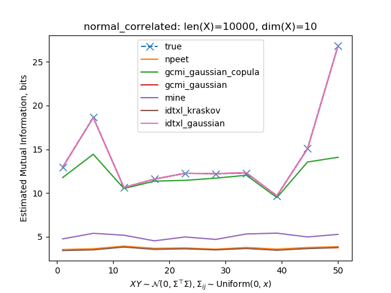

# Entropy estimators benchmark

Estimators of Shannon entropy and mutual information for random variables. Bivariate and multivariate. Discrete and continuous.

Estimators:
    
* NPEET, [Non-parametric Entropy Estimation Toolbox](https://github.com/gregversteeg/NPEET)
* GCMI, [Gaussian-Copula Mutual Information](https://github.com/robince/gcmi)
* MINE, [Mutual Information Neural Estimation](https://arxiv.org/pdf/1801.04062.pdf)

For different distribution families, one test is performed to compare estimated entropy or mutual information with the true (theoretical) value.

The input to estimators are two-dimensional arrays of size `(len_x, dim_x)`.

### Results

For complete analyses, refer to [Entropy estimation](results/entropy.md) or [Mutual Information Estimation](results/mutual_information.md) results.

To illustrate an example, below is a benchmark of mutual information estimation of normally distributed X and Y covariates:

### Running locally

To run tests locally,

1. Clone all the submodules:

   `git clone --recurse-submodules https://github.com/dizcza/entropy-estimators.git`

2. Install the requirements:

   `pip install -r requirements.txt`

3. Run the benchmark:

    * entropy: `python benchmark/entropy_test.py`
    * mutual information: `python benchmark/mutual_information_test.py`
