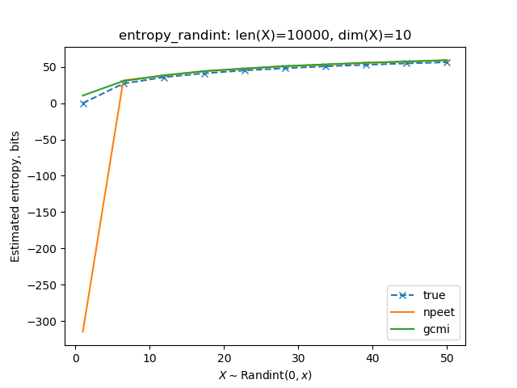
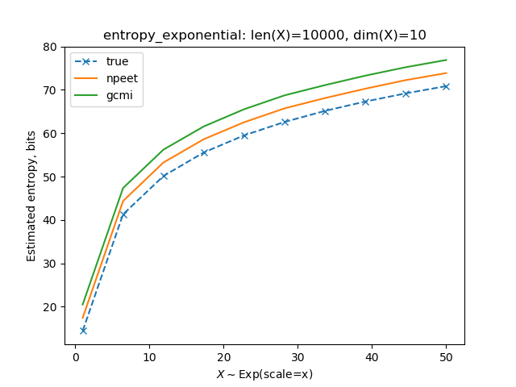

# Entropy estimators

Estimators of Shannon entropy and mutual information for random variables. Bivariate and multivariate. Discrete and continuous.

Estimators:
    
* NPEET, [Non-parametric Entropy Estimation Toolbox](https://github.com/gregversteeg/NPEET)
* GCMI, [Gaussian-Copula Mutual Information](https://github.com/robince/gcmi)
* KMeans, the simplest binning/clustering method from sklearn

To run test locally, clone all the submodules with one command

`git clone --recurse-submodules https://github.com/dizcza/entropy-estimators.git`


## Entropy

Because KMeans entropy heavily depends on the no. of clusters, it's included from the _entropy_ tests below. However, it'll be included in the mutual information tests.

Benchmark file source: `experiments/entropy_test.py`.

For a different families of distributions, one test is performed to compare estimated entropy with the true (theoretical) value.

The input to estimators are arrays of size `(n_samples, n_features)`.

### Entropy. Discrete distributions

1. Random integers in a range `[0, x+1)`.



* Note: NPEET entropy estimate of `x ~ randint(0, 2)` from the plot above is `-10` bits, which is, obviously, wrong, at least because entropy is a non-negative measure. NPEET estimator is unstable for `x ~ randint(i, i+2)` for any signed integer `i`. This is the only limitation I found, which is not important, taking into account that it's been developed for the continuous random variables and still works fine with discrete r.v.

### Entropy. Continuous distributions

1. Exponential distribution with a scale `x`.



2. MultiVariateNormal distribution with a covariance matrix with diagonal elements equal to `x^2` and smaller non-diagonal covariance values. For std=1 and `n_features=3`,

```
[[1.         0.25       0.16666667]
 [0.25       1.         0.25      ]
 [0.16666667 0.25       1.        ]]
```


3. Uniform distribution `U(0, x)`


## Mutual Information

// TODO