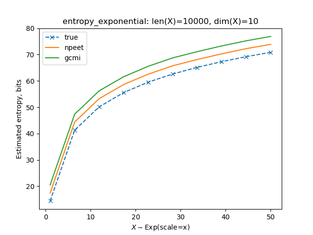

## Entropy Estimators

Benchmark file source: [`benchmark/entropy_test.py`](../../benchmark/entropy_test.py).

For different distribution families, one test is performed to compare estimated entropy with the true (theoretical) value.

The input to estimators are arrays of size `(len_x, dim_x)`.

Note: Mutual Information Neural Estimation (MINE) is not included in the analyses below because it estimates mutual information only, not entropy.

### Discrete distributions

1. Random integers in a range `[0, x+1)`.

   

   Note: NPEET entropy estimate of `x ~ randint(0, 2)`, as shown in the plot, is `-10` bits, which is obviously wrong, at least because entropy is a non-negative measure. NPEET estimator is unstable for `x ~ randint(i, i+2)` for any signed integer `i`. This is the only limitation I found, which is not important, taking into account that it's been developed for the continuous random variables and still works fine with discrete r.v.

### Continuous distributions

For continuous distributions, the _differential_ entropy is computed.


1. Exponential distribution with scale `x`.

   

2. MultiVariateNormal distribution whose covariance matrix has non-zero diagonal elements, enforcing correlation between the columns of X.

   

3. Uniform distribution `U(0, x)`

   


## Estimator's running time

```
npeet: 308.763 ms
gcmi: 0.827 ms
```
