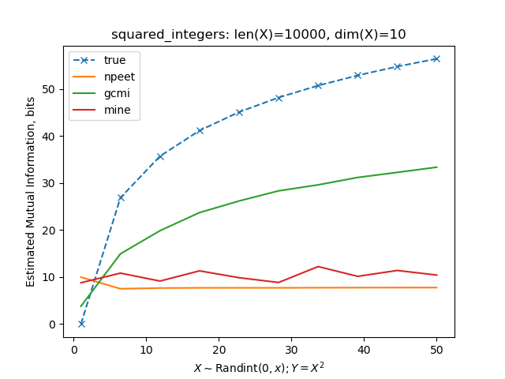
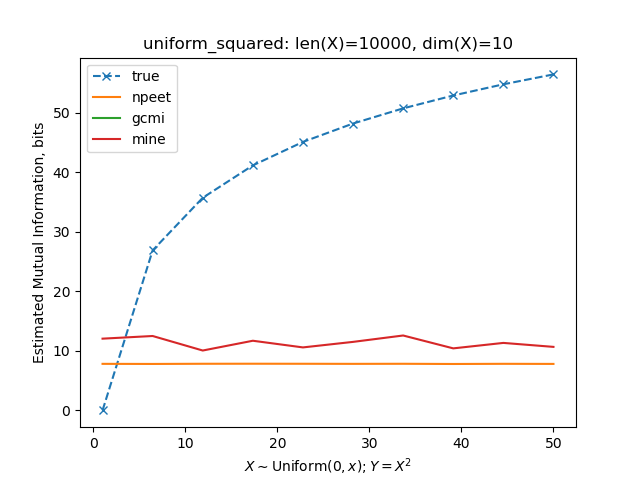
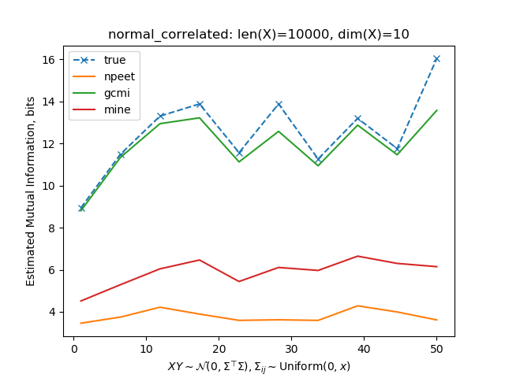
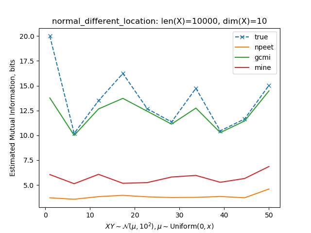
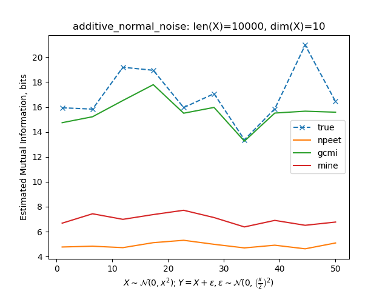

## Mutual Information Estimators

Benchmark file source: [`experiments/entropy_test.py`](../experiments/entropy_test.py).

For different distribution families, one test is performed to compare estimated mutual information with the true (theoretical) value.

The input to estimators are arrays of size `(len_x, dim_x)`.

### Discrete distributions

1. `X` are random integers in range `[0, x+1)`, `Y = X^2`.

   

### Continuous distributions

For continuous distributions, the _differential_ mutual information is computed.

#### Uniform distribution

`X` is sampled from `U[0, x]`, `Y = X^2`.

The differential mutual information `I_diff(X;Y)` is exactly the same as (non-differential) mutual information `I(X;Y)` in the previous example with random integers `X`.

This example illustrates imperfectness of GCMI, for it requires the matrix `Cxy = XY.T @ XY`, where `XY` is column-wise concatenated X and Y, to be positive semidefinite to compute Cholesky decomposition of `Cxy`. The condition in this example is not satisfied and hence no plot for GCMI is shown below (technically, they are all NaNs and ignored by matplotlib).

#### Normal distribution

1. X and Y are sampled from zero-centered MultiVariateNormal distribution whose covariance matrix has non-zero diagonal elements, enforcing correlation between X and Y.

   

2. Same as in \[1\], but the location of each variate in MultiVariateNormal distribution is non-zero. Hint: mutual information and entropy do not depend on the location of a normal distribution.

   

3. Same as in \[1\] with additive Gaussian noise.

   
