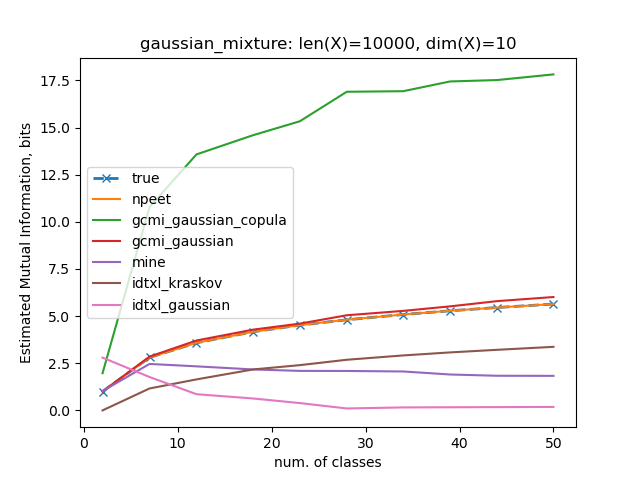

## Mutual Information Classifier Estimators

Benchmark file source: [`benchmark/mutual_information_test.py`](../../benchmark/classifiers_test.py).

For different distribution families, one test is performed to compare estimated mutual information with the true (theoretical) value.

The input to estimators are arrays of size `(len_x, dim_x)`.

### Gaussian Mixture Models

```
mu ~ Uniform(-10, 10) of size N; centroids, fixed
y_i ~ range(0, N); a class label
X_i ~ Normal(mu[y_i], scale=sqrt(10.0)) of size 10; a feature vector
```

1. `y_i` are labels

   

2. `y_i` is a probability vector

    If instead of a class label we output `y_i` as a probability vector of size `N`, where the entries `y_i[j]` correspond to the probability of assigning a feature vector `X_i` to the class label `j`,

    

### Softmax probability

`X_i` is a probability vector of a hypothetical classifier (you can think of it as a vector `y_i` from the previous step), and `y_i = argmax(X_i)`.


## Conclusions

As you can see, there is no "the best" estimator for the classification task, as it was the case with all other tasks - entropy and MI distributions.
